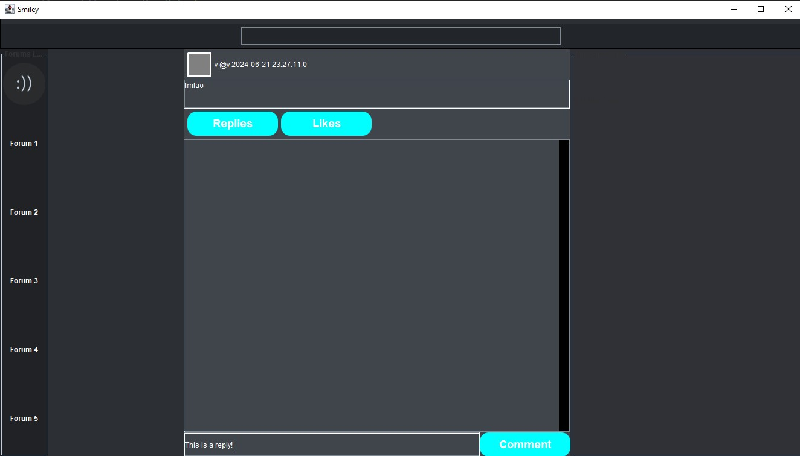

# Smiley a Twitter-Like Social Media System

This project is a **Twitter-like social media system** developed in **Java**, featuring user interactions such as tweeting, live chat, and database-driven functionality. It consists of a **Client-Server architecture** with a **MySQL database** for data storage.

## Features
### 📝 Core Functionalities
- **User Authentication**: Sign up, log in, and manage profiles.
- **Tweet System**: Users can post, view, and delete tweets.
- **Live Chat**: Real-time messaging system between users.
- **Follow System**: Users can follow/unfollow others.
- **Database Storage**: Stores tweets, user data, and chat logs in MySQL.
- **Search Functionality**: Search for your desired tweet or person.
- **Notification System**: Recieve notifications when users message you.
- **Online/Offline Status**: Users can see if other users are online or offline.
- **Comments**: Users can post comments on other people's posts.

## 📸 Screenshots

### Login Page


### User Dashboard


### Tweet Interface


### Tweet Interface


## 🗄️ Database Setup
1. Install MySQL and create a database named `Smiley`.
2. Run the provided SQL script (`mysql.sql`) to create tables. (Server/Database/mysql.sql)
3. Update database credentials in `Server/Database/DatabaseConfig.java`.

## 🚀 How to Run the Project
### Prerequisites
- **Java (JDK 8 or higher)**
- **MySQL Database**

### Steps
1. **Clone the Repository**
   ```sh
   git clone https://github.com/Ohtears/Smiley.git
   cd Smiley
   ```
2. **Start MySQL Database**
3. **Configure Database in `Server/Database/MYSQLHandler.java`**
4. **Run the Server**
   ```sh
   cd Server
   javac -cp .:lib/* Server/Network/ResponseHandler.java
   java -cp .:lib/* Server/Network/ResponseHandler
   ```
5. **Run the Client**
   ```sh
   cd Client
   javac -cp .:lib/* Client/GUI/MainApp/MenuMain.java
   java -cp .:lib/* Client/GUI/MainApp/MenuMain
   ```

## 📡 Networking & Real-Time Features
- Uses **Java Sockets** for real-time client-server communication.
- **Threaded architecture** ensures responsiveness.
- Messages are delivered in real-time with **asynchronous processing**.

## 📌 Future Enhancements
- Implement a **Like System**.
- Add **Profile Pictures**.
- Enhance the **user interface with modern UI frameworks**.
- Optimize live chat for **better efficency**.

## 👨‍💻 Author
Developed as a **Twitter-like system** with Java, MySQL, and real-time messaging capabilities.
